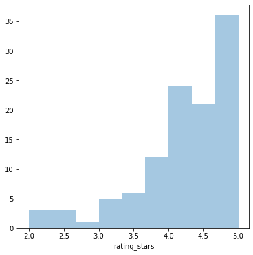
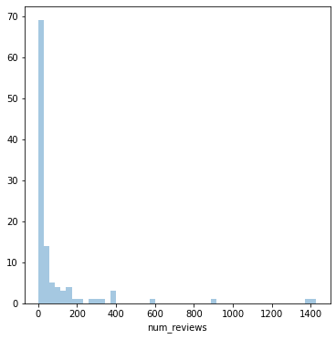
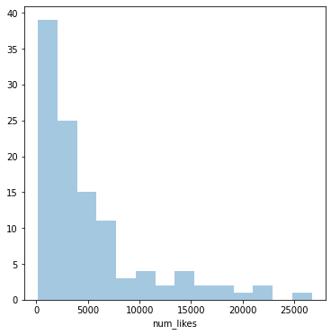

# Choose best Sephora Make-up Products With A Limited Budget
This repository contains two notebooks:
- One notebook named *Web Scrapping For Infinite Scrolling Websites Using Selenium.ipynb* which provides the web scrapping code I developed for infinite scroll web pages
- Another notebook called *How to choose gifts from Sephora if you know nothing about makeup.ipynb* is a project that applies the web scrapping code to extract product information from Sephora, and finally chooses the best combination of two products for me in a given budget. 
- I also posted an article related to this topic: [Using Python and Selenium to Scrape Infinite Scroll Web Pages](https://medium.com/@kuan.wei0413/using-python-and-selenium-to-scrape-infinite-scroll-web-pages-825d12c24ec7)

# Sephora Project Overview
Girls love makeup products, and they also like surprises. So, naturally, sometimes they want their boyfriends (or guy friends in general) to give them makeup products as surprise gifts. Unfortunately, guys usually have very little sense about makeup, or not at all. Thus, choosing makeup products can be a great challenge for guys. I have a girlfriend who also loves makeup product, and I am one of the guys who knows nothing about it. I visited Sephora - a very popular company that sells various make-ups - but I found it was hard to use its filter system as it only allows you to filter one criterion at a time. For example, if you only want products with less than $100 and you filter the products by price, you won't be able to further sort the products by the number of reviews. I then realize that I can use my data science skills to help me find the products I want. So in this notebook, I developed a script to help me automatically choose the best newly-arrived makeup products, within a given budget. In the project, I did the following:
- Scaped over 100 "Just arrived" make-up products from Sephora website
- Created a script that helps me choose the best combination of newly arrived make-up products with a given budget of $100

## Code and Resources Used
**Python Version**: 3.7

**Packages**: selenium, Beautifulsoup, urljoin, pandas

**Sephora Make-up Website**: ww.sephora.com/ca/en/beauty/new-makeup

## Medium Article
https://medium.com/@kuan.wei0413/using-python-and-selenium-to-scrape-infinite-scroll-web-pages-825d12c24ec7

## Web Scraping
Used self-designed scrapping script for infinite scroll web pages. With each product, the following information is scrapped:
- Brand Name
- Product Name
- Product Rating (in stars)
- Number of Reviews
- Number of Likes
- Price

## Plots of Information Scraped

## Top Five Combinations Selected By Script

